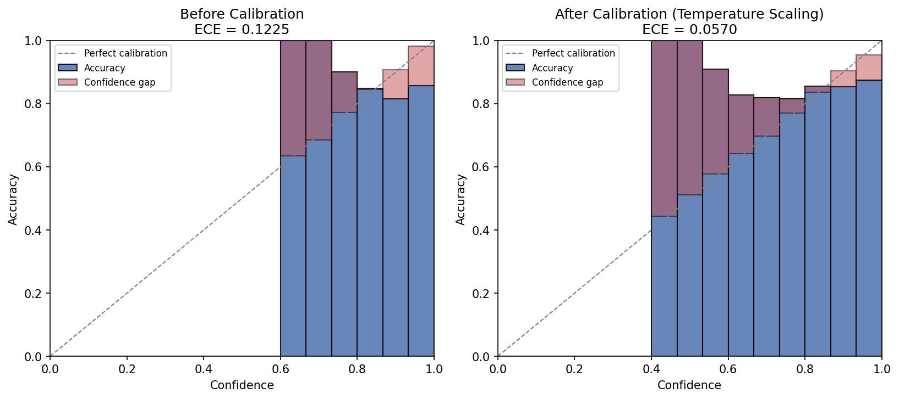

# Calibrated Retinopathy Diagnosis

**Calibration and uncertainty quantification for trustworthy medical image classifiers**

This project is a standalone framework I built for calibration and uncertainty
quantification in medical image classifiers, extending a 5-class diabetic
retinopathy grading model with post-hoc calibration (temperature scaling) and
reliability diagrams to expose where predictions are confidently wrong. I
designed and implemented the full pipeline myself, with the goal of making
model confidence something a clinician can actually act on.

It builds directly on my [`diabetic-retinopathy-detection`](https://github.com/mariam-madata/diabetic-retinopathy-detection)
repo (ResNet18, 5-class DR grading, 83% test accuracy), which reports high
accuracy but says nothing about whether the model's confidence is
*trustworthy* — a model can be 83% accurate while being wildly over- or
under-confident on individual predictions. In a clinical screening context,
a confidently wrong prediction is far more dangerous than an uncertain one,
because uncertainty is a signal a clinician can act on (e.g., flag for
manual review) while false confidence is not. This framework quantifies
that gap and corrects it.

## What it does

1. **Measures miscalibration** using Expected/Maximum Calibration Error
   (ECE/MCE), Brier score, and negative log-likelihood (NLL).
2. **Visualizes it** with reliability diagrams and confidence histograms.
3. **Corrects it** using temperature scaling (Guo et al., 2017) — a single
   learned scalar that rescales logits without touching the underlying
   model's weights or its accuracy.
4. **Evaluates the correction** on a held-out test split, never the split
   used to fit the temperature, to avoid leakage.

## Repository structure

```
calibration/
  temperature_scaling.py   # TemperatureScaler: fits T via NLL minimization (LBFGS)
  metrics.py                # ECE, MCE, Brier score, NLL, per-bin statistics
  reliability_diagram.py    # Reliability diagrams + confidence histograms
demo/
  generate_demo_logits.py   # Synthetic demo logits (see "About the demo data" below)
  run_calibration_demo.py   # End-to-end pipeline: load -> measure -> calibrate -> re-measure -> plot
scripts/
  extract_logits_from_model.py  # Pulls REAL logits from the trained ResNet18 checkpoint
tests/
  test_calibration.py        # Unit tests for every metric and the scaler itself
results/
  calibration_results.json   # Latest run's before/after metrics
  reliability_before_after.png
```

## Quickstart

```bash
pip install -r requirements.txt
python demo/run_calibration_demo.py
pytest tests/
```

## About the demo data

I don't have GPU access or the original APTOS dataset in every environment I
work in, so `demo/generate_demo_logits.py` generates **synthetic logits**
for demonstrating the pipeline — clearly documented as such in the module
docstring. The synthetic logits are constructed to mimic the class-wise
difficulty reported in the real model's README (No_DR F1 0.98, Moderate
0.77, Mild 0.67, Proliferate_DR 0.54, Severe 0.34) and the real APTOS 2019
class distribution, and are deliberately built to be over-confident — the
exact failure mode temperature scaling is designed to correct.

To get real numbers from the actual trained model: run
`scripts/extract_logits_from_model.py` against the trained checkpoint and
the APTOS validation/test splits (e.g. on Colab, where the checkpoint and
dataset are available), then re-run `demo/run_calibration_demo.py` with
`use_cached=True` pointing at the resulting `.npy` files in
`demo/cached_logits/`.

## Latest demo run (synthetic logits)

| Metric | Before calibration | After calibration |
|---|---|---|
| Accuracy | 0.854 | 0.854 (unchanged, by design) |
| ECE ↓ | 0.1225 | **0.0570** |
| Brier ↓ | 0.2849 | **0.2743** |
| NLL ↓ | 0.9057 | **0.6718** |
| MCE | 0.3647 | 0.5563 |

Learned temperature: **T = 1.65**.

ECE, Brier score, and NLL all improve substantially — the model's stated
confidence moves much closer to its actual accuracy. MCE (the single
worst-calibrated confidence bin) doesn't reliably improve with temperature
scaling; this is a known nuance in the calibration literature, since MCE is
dominated by whichever bin happens to have the fewest, noisiest samples,
rather than reflecting overall calibration quality. This is why ECE, not
MCE, is the standard headline metric in most calibration papers.



## Why this matters for low-resource clinical settings

In settings with limited specialist ophthalmologist access — the exact
context automated DR screening is meant to help — a calibrated confidence
score lets a clinic set a principled referral threshold ("only auto-clear
cases where calibrated confidence exceeds X%, refer everything else for
manual review") instead of trusting raw softmax outputs that are known to
be systematically over-confident in deep networks.

## References

- Guo, C., Pleiss, G., Sun, Y., & Weinberger, K. Q. (2017). *On Calibration
  of Modern Neural Networks.* ICML.
- Naeini, M. P., Cooper, G., & Hauskrecht, M. (2015). *Obtaining Well
  Calibrated Probabilities Using Bayesian Binning.* AAAI.

## Author

**Mariam Khamis Madata**
MSc Data Science (First Class), Chandigarh University
[Portfolio](https://mariam-madata.github.io) · [GitHub](https://github.com/mariam-madata) · [LinkedIn](https://linkedin.com/in/mariam-madata-183aa7187)
